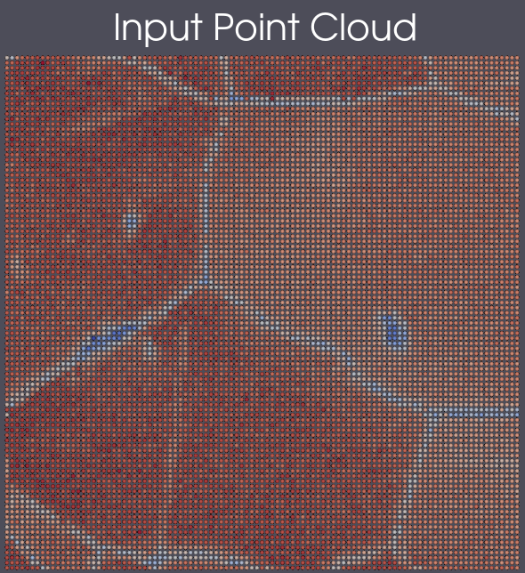
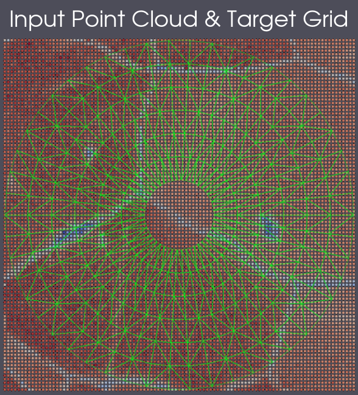
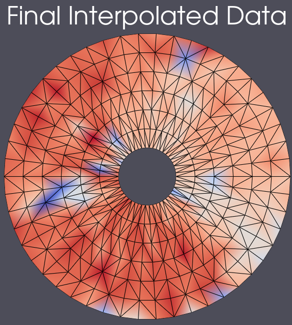

# Interpolate Values To Unstructured Grid

**THIS FILTER IS UNTESTED, UNVERIFIED AND UNVALIDATED. IT IS AN EXPERIMENTAL FILTER THAT IS UNDERGOING LONG TERM DEVELOPMENT
AND TESTING. USE AT YOUR OWN RISK**

## Group (Subgroup)

Reconstruction (Grouping)

## Description

This filter will sample a point cloud's data onto a target unstructured grid (Vertex, Edge, Triangle, Quad, Hex, Tet Geometry) via a nearest neighbor algorithm.

% Auto generated parameter table will be inserted here

## References

## Example Pipelines

## License & Copyright

Please see the description file distributed with this **Plugin**

## DREAM3D-NX Help

If you need help, need to file a bug report or want to request a new feature, please head over to the [DREAM3DNX-Issues](https://github.com/BlueQuartzSoftware/DREAM3DNX-Issues/discussions) GItHub site where the community of DREAM3D-NX users can help answer your questions.
